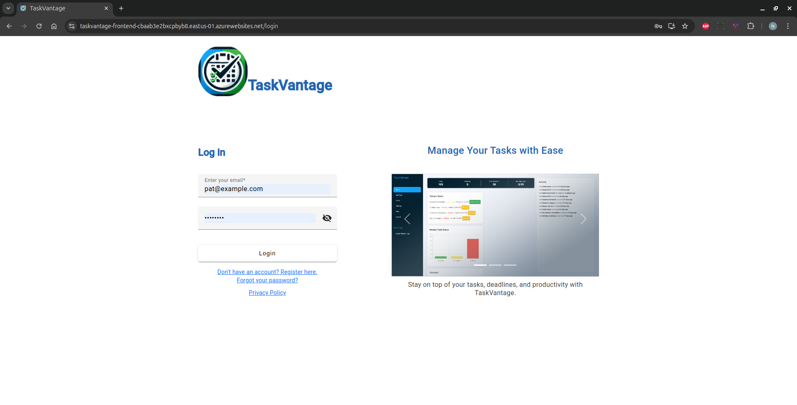
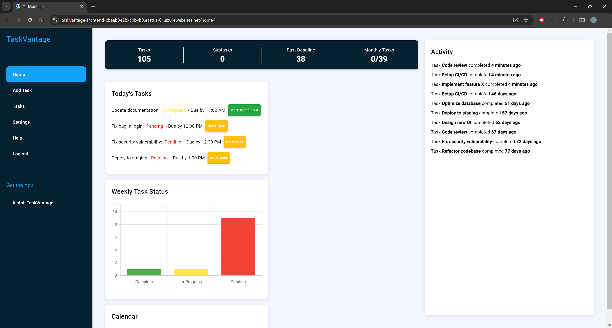
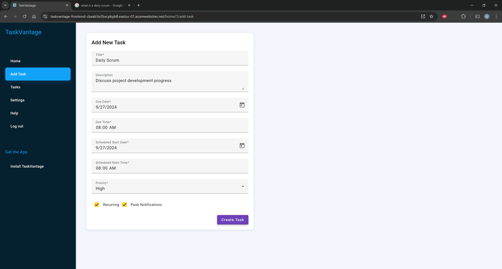
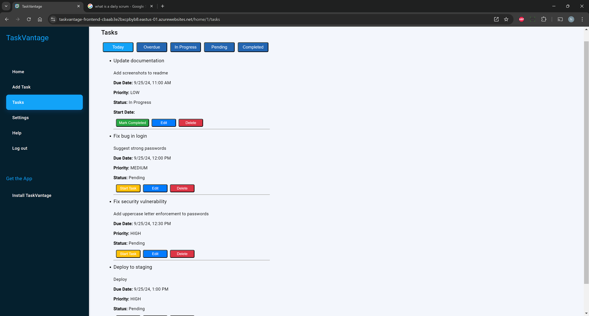
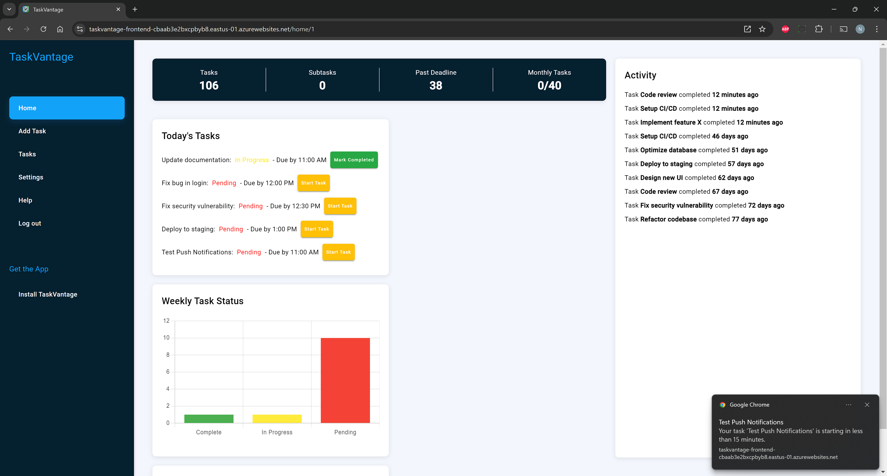

# TaskVantage

TaskVantage is a comprehensive task management web application designed to help users efficiently manage their daily tasks, subtasks, and projects. The application provides a user-friendly interface for task creation, organization, and tracking, making it an ideal tool for individuals and teams looking to stay productive.

## Features

- **User Authentication**: Secure login and registration system with OAuth integration coming soon for Google, Facebook, and Apple.
- **Task Management**: Create, update, and delete tasks with properties such as title, description, due date, priority, status, tags, and more.
- **Subtasks**: Break down complex tasks into manageable subtasks.
- **Reminders and Notifications**: Set reminders for important tasks and get notified about upcoming deadlines.
- **Task Filtering**: Filter tasks based on their status (Today, Overdue, In Progress, Pending, Completed).
- **Dashboard Overview**: Get a quick overview of tasks, including totals for tasks, subtasks, and tasks past their deadline.
- **Activity Tracking**: View recent completed tasks in the activity feed.
- **Responsive Design**: Optimized for both desktop and mobile devices.

## Showcase

Here are some screenshots showcasing the key features of the TaskVantage application:

### Secure User Authentication

The login page provides a secure authentication system where users can log in with their credentials.


### Intuitive Home Dashboard

The home page offers a clean, user-friendly dashboard where users can view a quick overview of their tasks and progress.


### Task Creation and Management

The "Add Task" interface allows users to easily create tasks with details such as title, description, due date, and priority.


### Organized Task List and Filtering

Users can manage and filter tasks based on their status, such as pending, in-progress, and completed, providing a clear view of their workload.


### Real-Time Push Notifications

TaskVantage features push notifications, ensuring users are alerted about upcoming deadlines and important reminders in real time.


## Technologies Used

- **Frontend**:
  
  - Angular
  - TypeScript
  - Angular Material
  - Chart.js for data visualization

- **Backend**:
  
  - Spring Boot (Java)
  - MySQL Database
  - JPA/Hibernate for database interaction

- **Deployment**:
  
  - Azure DevOps for CI/CD pipeline
  - Azure App Services

## Installation

### Prerequisites

You will need to set a number of environment variables:

- EMAIL_PASSWORD
- DB_URL
- DB_USERNAME
- DB_PASSWORD
- SPRING_PROFILES_ACTIVE
- GOOGLE_CAL_ID (obtain in google cloud console)
- GOOGLE_CAL_SECRET (obtain in google cloud console)
- JWT_SECRET (generate this using node.js and randomBytes)

### Dependencies

- Node.js and npm
- Angular CLI
- Java 17+
- MySQL

### Frontend Setup

1. Clone the repository:
   
   ```bash
   git clone https://github.com/nickking93/TaskVantage.git
   ```

2. Navigate to the frontend directory:
   
   ```bash
   cd frontend/task-manager
   ```

3. Install the dependencies:
   
   ```bash
   npm install
   ```

4. Run the Angular development server:
   
   ```bash
   ng serve
   ```
   
   The frontend should now be running at `http://localhost:4200`.

### Backend Setup

1. Navigate to the backend directory:
   
   ```bash
   cd backend
   ```

2. Set up the MySQL database:
   
   - Create a database named `taskvantage`.
   - Update the `application.properties` file with your MySQL credentials or create environmental variables to hold them.

3. Build and run the Spring Boot application:
   
   ```bash
   mvn clean install
   mvn spring-boot:run
   ```
   
   The backend should now be running at `http://localhost:8080`.

## Usage

- Register or log in with your credentials.
- Start by creating a new task using the "Add Task" button.
- Use the sidebar to navigate between different sections like tasks, settings, and help.
- Filter tasks by their status using the filter options provided.
- View task progress and statistics on the dashboard.

## Contributing

Contributions are welcome! If you find any bugs or have feature suggestions, feel free to open an issue or submit a pull request.

## License

This project is licensed under the MIT License. See the [LICENSE](./policy.md) file for more details.

## Contact

For any inquiries or support, you can reach me at:

- Email: [nickking93@live.com](mailto:nickking93@live.com)
- LinkedIn: [LinkedIn](https://linkedin.com/in/rnking93)
- GitHub: [GitHub](https://github.com/nickking93)